# codecraft 优化历程（性能优化）

> Base Env
>
> - MacBook Pro：M1 芯片，16 + 512
> - JDK 17
> - 不到 百兆宽带

## 一、核心功能性能优化

### 1.1 下载生成器接口

> `downloadGeneratorById`

#### 原始前端测试

下载 6.9MB 的小文件：


现在上传一个大文件（30.4MB）测试，首先需要修改后端配置：

```yaml
spring:
  servlet:
    multipart:
      # 大小限制
      max-file-size: 100MB
      max-request-size: 100MB
```


性能急剧下降，需要优化！！！

#### 定位性能瓶颈

```java
@GetMapping("/download")
public void downloadGeneratorById(Long id, HttpServletRequest request,
                                  HttpServletResponse response) throws IOException {
    if (id == null || id <= 0) {
        throw new BusinessException(ErrorCode.PARAMS_ERROR);
    }

    StopWatch stopWatch = new StopWatch();

    stopWatch.start("【下载生成器接口】查询数据库");
    User loginUser = userService.getLoginUser(request);
    Generator generator = generatorService.getById(id);
    if (generator == null) {
        throw new BusinessException(ErrorCode.NOT_FOUND_ERROR);
    }

    String filepath = generator.getDistPath();
    if (StrUtil.isBlank(filepath)) {
        throw new BusinessException(ErrorCode.NOT_FOUND_ERROR, "产物包路径不存在");
    }
    stopWatch.stop();

    // 追踪事件
    log.info("user {} download {}", loginUser, filepath);

    COSObjectInputStream cosObjectInput = null;
    try {
        stopWatch.start("【下载生成器接口】从对象存储下载数据");
        COSObject cosObject = cosManager.getObject(filepath);
        cosObjectInput = cosObject.getObjectContent();
        // 处理下载到的流
        byte[] bytes = IOUtils.toByteArray(cosObjectInput);
        stopWatch.stop();

        stopWatch.start("【下载生成器接口】写入响应");
        // 设置响应头
        response.setContentType("application/octet-stream;charSet=UTF-8");
        response.setHeader("Content-Disposition", "attachment; filename=" + filepath);
        // 写入响应
        response.getOutputStream().write(bytes);
        response.getOutputStream().flush();
        stopWatch.stop();

        // 打印测试结果
        System.out.println(stopWatch.prettyPrint());
    } catch (Exception e) {
        log.error("file download error, filepath = " + filepath, e);
        throw new BusinessException(ErrorCode.SYSTEM_ERROR, "下载失败");
    } finally {
        if (cosObjectInput != null) {
            cosObjectInput.close();
        }
    }
```


1）下载 30.4MB 的文件

```java
StopWatch '': running time = 4669902292 ns
---------------------------------------------
ns         %     Task name
---------------------------------------------
184673334  004%  【下载生成器接口】查询数据库
4392871333  094%  【下载生成器接口】从对象存储下载数据
092357625  002%  【下载生成器接口】写入响应
```

2）下载 6.8MB 的文件

```java
StopWatch '': running time = 1030502626 ns
---------------------------------------------
ns         %     Task name
---------------------------------------------
019889000  002%  【下载生成器接口】查询数据库
996719917  097%  【下载生成器接口】从对象存储下载数据
013893709  001%  【下载生成器接口】写入响应
```

显然，瓶颈是在从对象存储下载数据中，下面开始优化。

#### 下载优化 —— 官方文档

由于使用的是 腾讯云COS服务，直接来看官方文档：https://cloud.tencent.com/document/product/436/13653

> 小贴士：知名中间件、大型云厂商等等提供的服务，一般来说都会有最佳实践（Best Practice），先盘他！

下载服务是高GET请求，官方文档给出了两种优化方式：


除此之外，对于下载大文件，我们还可以采用流式处理的方式，流式处理的好处是防止大文件占满内存，导致OOM。

那么对于上述三种方案，CDN服务需要额外的流量，此处不采用，我们测试其余两种方案。


#### 下载优化 —— 流式处理

```java
response.setContentType("application/octet-stream;charSet=UTF-8");
response.setHeader("Content-Disposition", "attachment; filename=" + filepath);

try (OutputStream out = response.getOutputStream()) {
    byte[] buffer = new byte[4096];
    int bytesRead;
    while ((bytesRead = cosObjectInput.read(buffer)) != -1) {
        out.write(buffer, 0, bytesRead);
    }
} catch (IOException e) {
    log.error("file download error, filepath = " + filepath, e);
    throw new BusinessException(ErrorCode.SYSTEM_ERROR, "下载失败");
}
```

测试结果：


可以看出来，在此处，流式处理并没有减少响应时间。因为无论是否是流式处理，都需要从对象存储中下载文件，再返回给前端。这种方案 PASS。

#### 下载优化 —— 本地缓存

首先需要明确缓存的适用场景：**读多写少**。分析下代码生成器的场景，是符合这样的业务特点的。

本质上来说，CDN也是一种缓存，不选用CDN服务的话，可以使用本地缓存来代替。本地缓存的方式不需要额外引入存储技术，只需要将下载过的代码生成器保存在服务器上，之后要下载时，如果服务器上已经有下载后的文件，就不需要从对象存储中获取了，直接读取返回给前端即可。

这里需要明确下**缓存的核心四要素**：

1. 缓存内容
2. 缓存key的设计
3. 缓存淘汰机制
4. 保证缓存一致性

1）第一个问题，缓存内容。

此处我们不用每个文件都缓存，一是因为难以控制占用的时间，二是需要考虑每个文件的缓存一致性，增大开发成本。此处呢，我们手动选择缓存哪些文件，可以通过接口的方式提前缓存指定文件。除此之外呢，我们还可以设定一个**热点阈值**，通过一些方法来识别出热点代码生成器进行缓存，比如说统计代码生成器的使用情况，然后通过定时任务（或者每次用户下载之后）判断代码生成器的使用情况是否超过了热点阈值，如果超过，则表示是热点数据，需要为其设置缓存。

> 参考：https://gitee.com/jd-platform-opensource/hotkey

2）第二个问题，缓存key的设计。

缓存key是用来唯一标识和查找某个缓存内容的。一般情况下，写入和读取的key是一致的，可以抽取一个公共方法来获取缓存key。由于没有引入额外的缓存技术，此处缓存key的设计就是文件在服务器上的存储路径。

3）第三个问题，缓存淘汰机制。

此处我们选择人工 + 定时任务配合的方式。通过编写一个清理缓存的接口，人工定期地清理；给缓存设置一个过期时间，通过定时任务定期清理。

4）第四个问题，保证缓存一致性。

如果用户重新上传了代码生成器文件，并且该代码生成器文件原始是热点数据，已经被缓存，我们应该保证用户下载到的不是缓存而是最新的文件。对于我们的系统来说，缓存一致性的要求不是很高，就算用户使用的是旧的代码生成器其实也不会影响太大，因为从用户更新代码生成器文件到其他用户使用期间，还会有审核等流程，所以此处我们采用简单的实现方式就是更新时删除缓存即可。


首先执行缓存结果，提前缓存好一个大文件（这也就是COS官方文档说的预拉热），然后调用接口下载该文件。测试结果：


可以看出，使用文件缓存之后，接口响应大大缩短，只需要100多毫秒就能完成下载，快了将近40倍。


### 1.2 使用生成器接口

> `onlineUseGenerator`

#### 原始前端测试


大约需要 3 ~ 4s 时间，应该是有优化空间的。


#### 定位性能瓶颈

先后两次执行同一个接口：

```java
StopWatch '': running time = 2418076373 ns
---------------------------------------------
ns         %     Task name
---------------------------------------------
176710333  007%  【使用生成器接口】查询数据库
1392278458  058%  【使用生成器接口】从对象存储下载文件
068993958  003%  【使用生成器接口】解压压缩包
006154500  000%  【使用生成器接口】写文件
767975083  032%  【使用生成器接口】执行生成命令
004561625  000%  【使用生成器接口】压缩文件
001402416  000%  【使用生成器接口】写回文件
```

```java
StopWatch '': running time = 4003701249 ns
---------------------------------------------
ns         %     Task name
---------------------------------------------
014268875  000%  【使用生成器接口】查询数据库
1076497750  027%  【使用生成器接口】从对象存储下载文件
065428875  002%  【使用生成器接口】解压压缩包
000526208  000%  【使用生成器接口】写文件
2844978666  071%  【使用生成器接口】执行生成命令
001928208  000%  【使用生成器接口】压缩文件
000072667  000%  【使用生成器接口】写回文件
```

从上述结果来看，下载、执行生成命令以及解压都是耗时操作。

#### 下载优化 —— 本地缓存

由于生成器脚本是由 maker 制作工具提前生成好的，执行脚本的操作优化可能比较困难。虽然可以优化，比如使用多线程并发生成文件，但是实现复杂度过高，性价比不高。

因此我们需要重点优化下载和解压操作，对于频繁使用的生成器，反复下载文件、解压文件都是没有必要的，因此可以使用本地缓存来改造。

使用本地缓存之后，测试结果：


```java
StopWatch '测试生成器接口': running time = 447767584 ns
---------------------------------------------
ns         %     Task name
---------------------------------------------
006736292  002%  【使用生成器接口】查询数据库
004448667  001%  【使用生成器接口】从本地缓存下载文件
071288166  016%  【使用生成器接口】解压压缩包
000404584  000%  【使用生成器接口】写文件
362803708  081%  【使用生成器接口】执行生成命令
002032750  000%  【使用生成器接口】压缩文件
000053417  000%  【使用生成器接口】写回文件
```


### 1.3 制作生成器接口

> `onlineMakeGenerator`

#### 前端原始测试


#### 定位性能瓶颈

先后两次执行一个接口：

```java
StopWatch '测试制作生成器接口': running time = 2952452415 ns
---------------------------------------------
ns         %     Task name
---------------------------------------------
005006000  000%  【制作生成器接口】查询数据库
098699500  003%  【制作生成器接口】从对象存储下载文件
010221041  000%  【制作生成器接口】解压文件
000903250  000%  【制作生成器接口】构造meta
2822179708  096%  【制作生成器接口】制作生成器
015442916  001%  【制作生成器接口】写回数据
```

```java
StopWatch '测试制作生成器接口': running time = 3010145125 ns
---------------------------------------------
ns         %     Task name
---------------------------------------------
004780000  000%  【制作生成器接口】查询数据库
104754458  003%  【制作生成器接口】从对象存储下载文件
013975875  000%  【制作生成器接口】解压文件
000382500  000%  【制作生成器接口】构造meta
2873041583  095%  【制作生成器接口】制作生成器
013210709  000%  【制作生成器接口】写回数据
```

简单分析可知，主要的耗时操作还是下载和制作。

#### 下载优化 —— 不经过对象存储

分析下载流程，先让用户将模板文件上传到对象存储，再从对象存储下载的过程其实是没有必要的，因为平台现在仅支持单次制作，制作完成之后，用户上传的模板就没有用了。因此可以通过请求参数的形式将原始文件传递给后端，既解约了对象存储资源，又提升了性能。

#### 制作优化 —— 异步化操作

虽然制作操作耗时比下载操作耗时更多，但其实 2 ~ 3秒对于使用制作功能的开发者来说是一个可以接受的范围，再加上调用了maker 项目，使用 maven 进行打包，优化的成本较大。

此处可以将生成器制作封装为一个任务，用户可以通过前端页面自主查看任务的执行状态并下载制作结果。

具体流程：异步化制作 -> 将生成的结果上传至对象存储 -> 返回前端地址 -> 等待用户下载。

此处先不优化啦~ 主要是前端的操作，先不深入去做了。


## 二、查询性能优化

什么情况下需要对数据查询进行性能优化呢？一般来说，有以下几个场景：

1. 数据需要高频访问
2. 数据量较大，查询缓慢
3. 数据查询实时性要求高，追求用户体验

对于本项目来说，主页代码生成器列表的访问频率是最高的，加上主页一般也需要有较快的加载速度，所以，优化它！


### 2.1 方法一：精简数据

> 目前，系统的数据量并不是很高，暂时不考虑高并发。从最简单的优化做起，目标是减少接口的响应时长，从而提噶整个页面的响应速度。

#### 整体测试

主页展示12条数据，初始数据（`fileConfig` 和 `modelConfig` 完整）：


通过浏览器控制台查看接口整体查询耗时，发现最大耗时超过了 150 ms


多测试几次，平均在 30ms 左右。

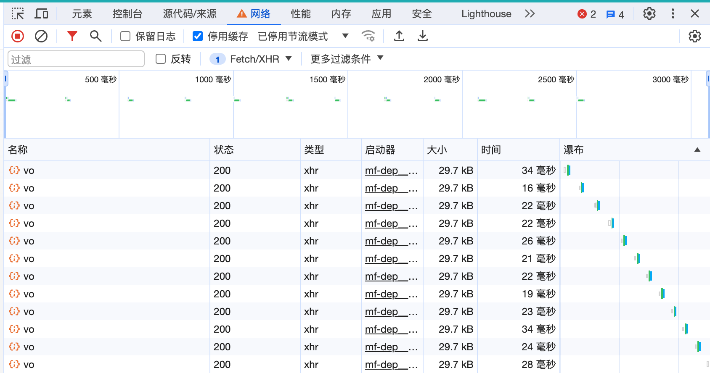

#### 分析性能瓶颈

```java
@PostMapping("/list/page/vo")
public BaseResponse<Page<GeneratorVO>> listGeneratorVOByPage(
    @RequestBody GeneratorQueryRequest generatorQueryRequest,
    HttpServletRequest request) {
    long current = generatorQueryRequest.getCurrent();
    long size = generatorQueryRequest.getPageSize();
    // 限制爬虫
    ThrowUtils.throwIf(size > 20, ErrorCode.PARAMS_ERROR);

    StopWatch stopWatch = new StopWatch("分页查询生成器");
    stopWatch.start("查询生成器");
    Page<Generator> generatorPage = generatorService.page(new Page<>(current, size),
                                                          generatorService.getQueryWrapper(generatorQueryRequest));
    stopWatch.stop();

    stopWatch.start("关联查询信息");
    Page<GeneratorVO> generatorVOPage = generatorService.getGeneratorVOPage(generatorPage,
                                                                            request);
    stopWatch.stop();

    // 打印测试结果
    System.out.println(stopWatch.prettyPrint());
    return ResultUtils.success(generatorVOPage);
}
```

先后多次测试：

```java
StopWatch '分页查询生成器': running time = 131514333 ns
---------------------------------------------
ns         %     Task name
---------------------------------------------
085324875  065%  查询生成器
046189458  035%  关联查询信息
```

```java
StopWatch '分页查询生成器': running time = 25988542 ns
---------------------------------------------
ns         %     Task name
---------------------------------------------
014805250  057%  查询生成器
011183292  043%  关联查询信息
```

非常奇怪的现象，数据库查询耗时接近130ms，为什么整个接口响应需要179ms呢？因为是存在一个下载耗时，服务器查询到数据后，还需要传输数据给前端。

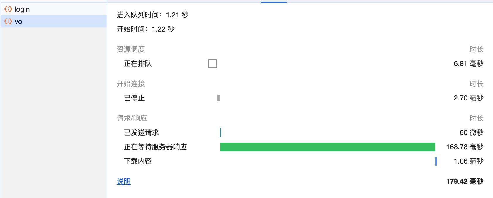


#### 优化

如何减少前端下载的时间呢？

2种方法：

1. 减少后端返回的数据体积，可以减少返回的数据，或者压缩数据
2. 提高服务器的带宽

显然，第一种方法的成本是最低的，所以我们可以尝试精简数据，只让后端返回主页需要展示的数据。本接口中，像`fileConfig`、`modelConfig`这些数据都是不必要的。

精简数据后测试：

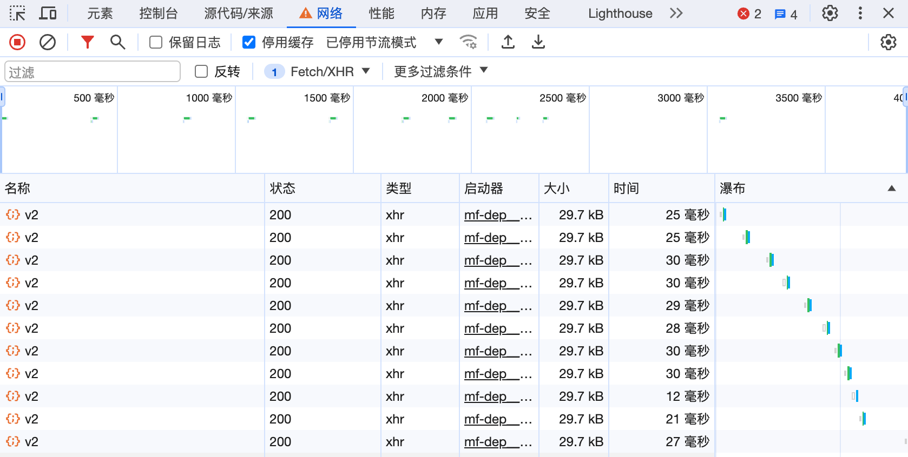

整体上优化了。而且查询的原始数据量越大，优化效果越明显。


### 2.2 方法二：SQL优化

事先向数据库中插入 10w 条数据，模拟真实情况。

#### 整体测试

查看接口的耗时：

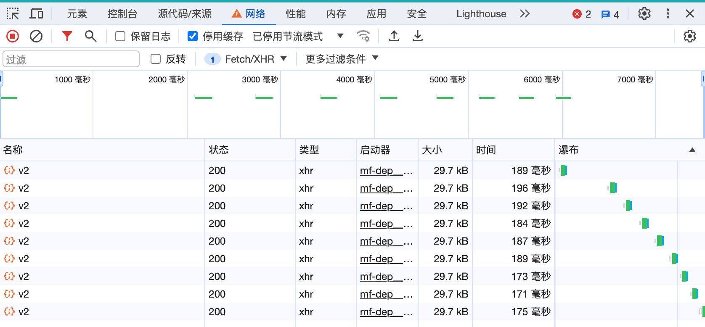

可以看出来，在数据量为10w的情况下，接口的耗时急剧增加，性能大幅下降，平均耗时在 180ms 。

然而，在实际的业务中，10w条数据其实是个正常（甚至偏小）的数据量级，如果数据量上百万、千万，查询性能肯定会更低，所以必须进一步优化。

#### 定位性能瓶颈

由于数据量增大导致查询性能降低，所以很容易就可以定位到时数据库查询数据的耗时增加了，因此我们需要做的就是优化数据库的查询。

首先定位SQL：

```sql
SELECT id,
       name,
       description,
       basePackage,
       version,
       author,
       tags,
       picture,
       fileConfig,
       modelConfig,
       distPath,
       status,
       userId,
       createTime,
       updateTime,
       isDelete
FROM generator
WHERE isDelete = 0
ORDER BY updateTime DESC
LIMIT 12;
```

将上述sql脚本重复执行10次，查看耗时：


执行总耗时 1744ms

#### 优化

如何优化数据库查询呢？

最常见的几种方案：

1. 减少查询次数，能不查数据库就不查数据库，比如使用缓存
2. 优化SQL语句
3. 添加合适的索引

进行优化时，我们优先选择成本最低的方案。

第一种方案通常需要引入额外的技术（缓存），稍后考虑。

第三种方案虽然改动的成本不高，但是对于我们主页的查询，默认没有添加任何的查询条件（除了 `isDelete=0`），再加上排序字段是前端传递的，变动的，不适用索引，所以也不适用添加索引来优化。

所以我们目前最应该做的，就是优化SQL语句。**只查询需要的字段。**


精简查询的字段之后：

```sql
SELECT id,
       name,
       description,
       author,
       tags,
       picture,
       userId,
       createTime,
       updateTime
FROM generator
WHERE isDelete = 0
ORDER BY updateTime DESC
LIMIT 12;
```


可以看出，查询十次的耗时为 1291ms，耗时减少了 25% 左右，说明方案可行。

> TODO：分页查询中的 `count` 函数优化

测试：

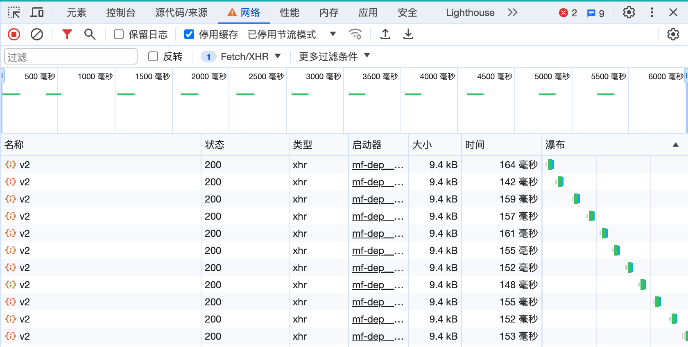

前端查询耗时优化到了 150ms 左右，提升了近 20%！

> 一般来说，单次查询时间超过 100ms、500ms 或者 1s 算是慢查询，目前来看，接口的性能还可以，能够应对用户量不大的场景。但是如果同时使用系统的用户增多、并发量增大之后，又该如何优化系统呢？

### 2.3 方法三：压力测试

由于我们的系统目前并没有那么多的并发请求，所以必须通过压力测试工具，通过创造线程模拟真实用户请求方式，来试高并发测试。

#### 明确测试情况

> 测试之前，一定要明确测试的环境、条件和基准。

- 环境：16G内存、8核 CPU、近百兆宽带的网速
- 条件：每次请求同样的结果（`v2`接口）、传递相同的参数
- 基准：始终保证接口的异常率为 0%，出现异常需要重新测试

**📢注意：压测前保证不会影响系统的正常运行，千万不要在线上压测！**

> 线上压缩 ≈ 造事故 ≈ 攻击

#### 测试工具

Apache JMeter。

下载地址：https://jmeter.apache.org/download_jmeter.cgi


#### 压测配置

1）创建线程组

核心参数：线程数、启动时间、循环次数

- 线程数 * 循环次数 = 要测试的请求总数
- 启动时间的作用是控制线程的启动速率，从而控制请求速率。比如，10s启动100个线程，那么每秒启动10个线程，相当于最开始每秒会发10个请求。

> 📢注意：
>
> - 需要根据自己的实际测试结果动态调整线程组，直到找到一个每次测试结果相对稳定的设置，从而消除线程组启动或者电脑配置不足导致的误差。
> - 每秒启动的线程数要大于接口的 qps，才能测试到极限，不能因为请求速度不够影响测试的结果


#### 压测

统一压测配置：

- 线程数：1000 个 / 组
- 启动时长：10s
- 循环次数：10次

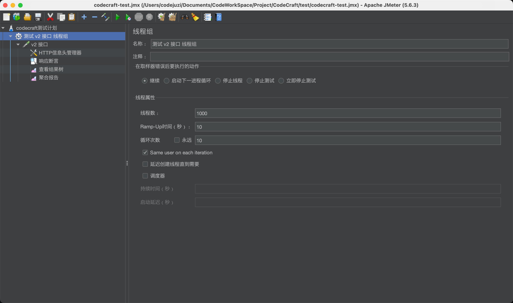

压测结果：

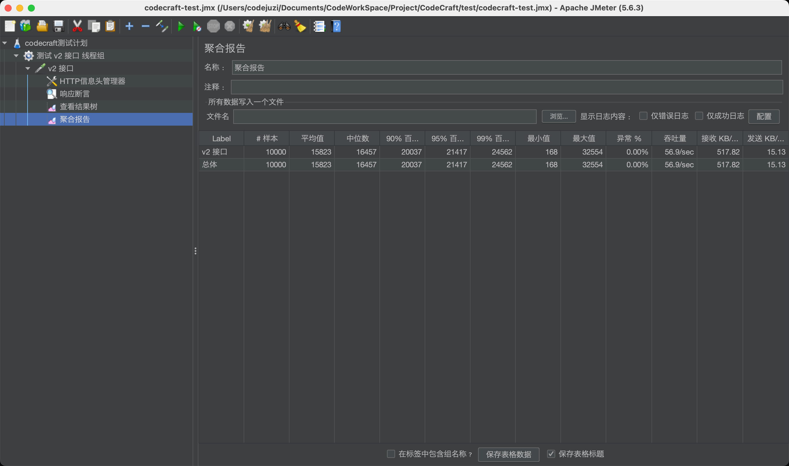

压测发现，1000个线程、10组、10s启动、保证0异常的前提下，qps为 56.9/s。而且因为后端处理能力跟不上请求速度，很多请求需要排队等待十几秒，甚至最大值要等待30多秒才能够得到响应。

那怎么才能够应对大量的并发请求？增加系统的qps、并且减少请求等待呢？

> QPS VS TPS：
>
> QPS (Queries Per Second)，每秒查询数，主要用于衡量系统的查询性能，通常在数据库、搜索引擎等场景中使用。每一个查询可以是数据库查询、HTTP请求、网络请求等。
>
> TPS (Transactions Per Second) 每秒事务数，主要用于衡量系统的事务处理能力，通常在交易、支付、订单处理等涉及多个步骤的场景使用。每一个事务可以包括多个操作步骤。
>
> 在实际的应用中，这两个指标的选取取决于系统的特性和关注点。如果系统主要是处理查询请求，那么QPS更合适；如果系统主要是进行复杂的事务处理，那么TPS更合适。

### 2.4 方法四：分布式缓存

想要提升数据的查询性能，最有效的办法之一就是**缓存**。把数据放到一个读取更快的介质，而不用每次都从数据库查询。

缓存尤其适用于 **读多写少** 的数据，可以最大程度利用缓存、并且减少数据不一致的风险。

针对于我们的项目，生成器的修改频率一般是很低的，而且实际运营的时候，生成器应该是需要人工审核才能够展示到主页到，所以对数据的实时性要求并不高，使用缓存非常合适。像实时电商数据大屏这种需要持续展示最新数据的场景，使用缓存的成本就比较大了。

此处选择的分布式缓存技术是 Redis


1）缓存key设计

规则：`业务前缀:数据分类:请求参数`

业务前缀和数据分类的作用是为了区分不同业务和接口的缓存，防止冲突。将请求参数作为key，就能实现不同的分页查询不同的缓存。需要注意的是，请求参数字符串可能很长，我们需要对其进行编码，这里选用 base64。

2）缓存内容设计

对于分页数据的缓存，有以下两种缓存方案：

1. 缓存整页数据
2. 分页的每条数据单独缓存。查询时先获取到 id 集合，再根据 id 集合去批量查询缓存。

> 推荐文章：https://www.zhihu.com/question/264744569/answer/3042972530

此处选择第一种方案，直接缓存接口的返回结果，不仅开发成本更低，性能也更高，但缺点就是不利于分页某一条数据的更新。

> 一般情况下，建议按需缓存，只缓存数据高频访问的情况，以提高缓存的利用率（命中率），比如只缓存首页数据的第一页。

此处先使用Redis的String数据结构，将分页数据对象转为JSON字符串后写入，相比于JDK自带的序列化机制，用JSON字符串会使得缓存可读性更好。

📢注意：一定要给缓存设置过期时间，做一个兜底。

#### 测试

页面测试，测试结果：

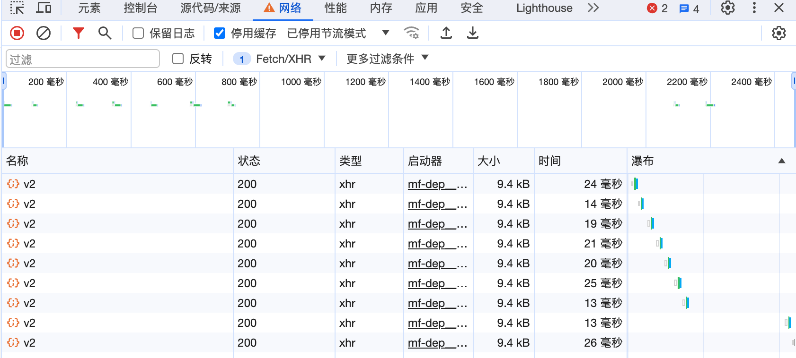

测试发现，使用缓存之后，响应时间大幅减少，平均耗时20ms，缩短了近 87%。

接下来进行压力测试，还是标准的配置（1000个线程，10组，10s启动），保证0异常的前提下，qps达到了 889.7 / s，已经是之前的 15 倍了！

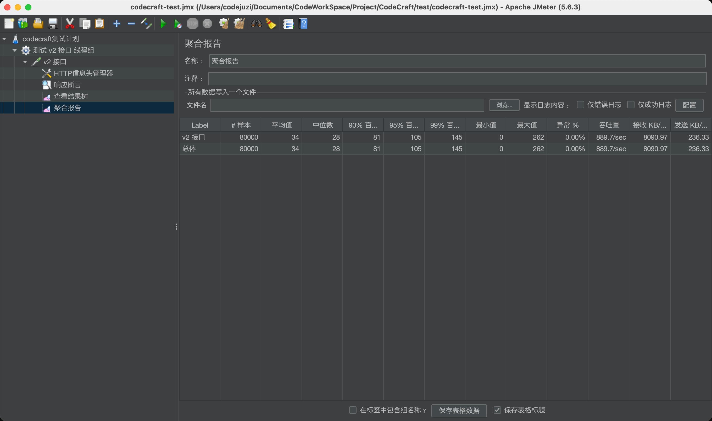


### 2.5 方法五：多级缓存

如果使用Redis还不能够满足要求，可以使用本地缓存，直接从内存中读取缓存、不需要任何网络请求，一般能得到进一步的性能提升。

#### Caffeine 本地缓存

官网：https://github.com/ben-manes/caffeine

文档：https://github.com/ben-manes/caffeine/wiki

快速开始：https://github.com/ben-manes/caffeine/wiki/Population


#### 多级缓存设计

对于分布式系统，我们一般不会单独使用本地缓存，而是将本地缓存和分布式缓存进行结合，形成多级缓存。

以 Caffeine 和 Redis 为例，通常会使用 Caffeine 作为一级缓存，Redis 作为二级缓存。

1）Caffeine 一级缓存：将数据存储在应用程序的内存中，性能更高，但是仅在本地生效，而且应用程序关闭后，数据会丢失。

2）Redis 二级缓存：将数据存储在 Redis 中，所有的程序都从 Redis 内读取数据，可以实现数据的持久化和缓存的共享。

二者结合，请求数据时，首先查找本地一次缓存，如果在本地缓存中没有查找到数据，再查找远程二级缓存，并且写入到本地缓存，如果还没有数据，才从数据库中读取，并且写入到所有缓存。

使用多级缓存，可以充分利用本地缓存的快速读取特性，以及远程缓存的共享和持久化特性。

#### 测试

页面整体测试：

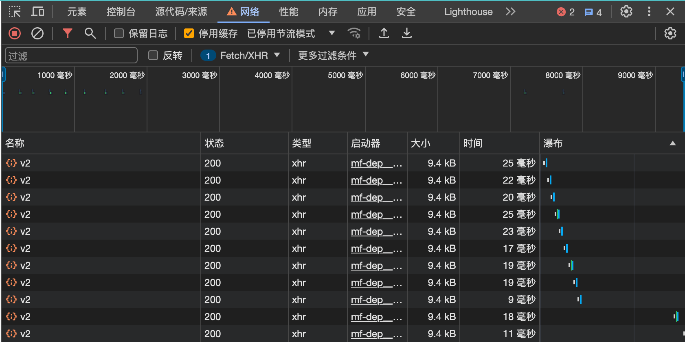

压力测试：

首先构建本地缓存，然后使用基准的线程组配置（1000个线程、10组、10s启动），保证0异常的前提下，QPS达到了 999.9 / sec，我们调大参数再测一次，


参数 1500个线程、10组、10s启动：

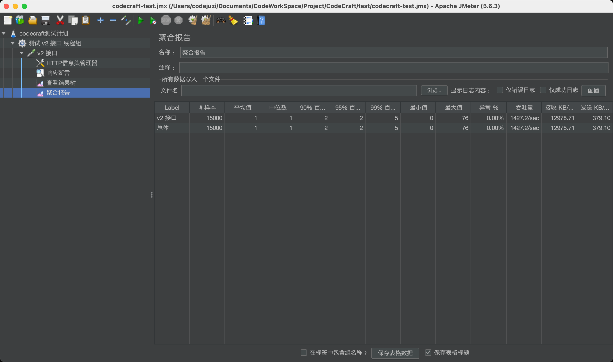

参数 2000个线程、10组、10s启动：


参数 1500个线程、10组、5s启动：


参数 2000个线程、10组、5s启动：


好了，基本上这就是极限了，QPS = 3329.4 / sec，这个数值很可观了吧！


### 2.6 方法六：计算优化

#### 分析

任何计算都会消耗系统的 CPU 资源，在 CPU 资源有限的情况下，我们能做的就是**减少不必要的计算**。

分析代码，基本上没有循环计算的逻辑，可能消耗计算资源的操作应该就是 JSON 序列化（反序列化）。

> 在 JSON 序列化中，需要遍历数据结构并将其转换为 JSON 格式的字符串。这个过程可能涉及到字符串拼接、字符编码转换等计算密集型操作。

之前是为了更直观的查看缓存数据，才将对象序列化为 JSON 后写入缓存，现在为了提高性能，可以直接用 JDK 默认的序列化工具读写缓存。

#### 测试

参数 1000个线程、100组、10s启动：


这已经开始做优化时候的近200倍了！


### 2.7 方法七：请求层参数优化

#### 参数优化

分析上述测试结果，当并发请求数量超出系统处理能力时，会出现请求排队，而且请求排队最长时间长达 8s，怎么解决这个问题呢？

用生活场景类比，快餐店中服务员不够了，只要增加工作人员的数量，就能同时服务更多顾客。而如果餐厅备菜速度足够快，可以增加排队的最大容量，起码在业务繁忙的 时候不用把顾客赶出去。

回到我们的后端系统，如果业务逻辑层很难进一步优化，可以尝试优化请求层。

比如 SpringBoot 项目默认使用嵌入式的 Tomcat 服务器接受处理请求，可以调整 tomcat 的参数，比如最大线程数 maxThreads、最大连接数 maxConnections、请求队列长度 accept-count 等，来增加同时接受处理请求的能力。

> 推荐文章：https://www.cnblogs.com/javastack/p/17756325.html

```yaml
spring:
  tomcat:
    max-connections: 10000
    threads:
      max: 5000
    accept-count: 1000
```

参数 1000个线程、100组、10s启动，测试结果：


具体参数的调整还是需要结合实际情况的。


#### 测试空接口性能

编写一个干净的，没有业务逻辑的接口，测试 Tomcat 服务器处理请求的最大性能。

```java
@RestController
@RequestMapping("/health")
public class HealthController {

    @GetMapping
    public String health() {
        return "ok";
    }

}
```

除此之外，注释掉所有可能影响到的AOP等，比如 日志AOP。

参数 1000个线程、100组、10s启动，测试结果：


空接口的极限 QPS 最高能到 10000，也就是我们无论如何优化业务逻辑，都是无法超过这个值的。

那么如何打破这个极限呢？

换一个框架嘛！

#### Vert.x 反应式编程

> https://www.techempower.com/benchmarks

官方文档：https://vertx.io/get-started/

```java
public class MainVerticle extends AbstractVerticle {

    @Override
    public void start() throws Exception {
        // Create the HTTP server
        vertx.createHttpServer()
                // Handle every request using the router
                .requestHandler(req -> {
                    req.response()
                            .putHeader("Content-Type", "text/plain;charset=UTF-8")
                            .end("ok");
                })
                // Start listening
                .listen(8888)
                // Print the port
                .onSuccess(server ->
                        System.out.println(
                                "HTTP server started on port " + server.actualPort()
                        )
                );
    }

    public static void main(String[] args) {
        Vertx vertx = Vertx.vertx();
        Verticle myVerticle = new MainVerticle();
        vertx.deployVerticle(myVerticle);
    }
}
```

参数 1000个线程、100组、10s启动，测试结果：

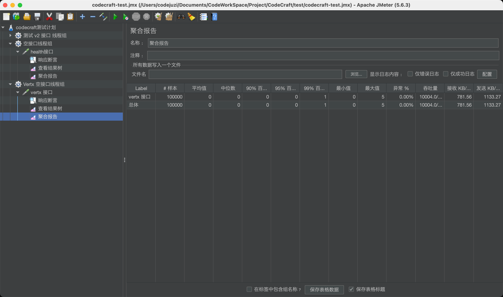

可以看出，Vertx的空接口QPS高达 一万多，说明Vertx的极限性能是要优于Tomcat的。

为什么？

1. 异步非阻塞
2. 事件驱动
3. 事件循环
4. 反应式编程

Vert.x正是使用了以上几个概念，才能够同时处理更多的并发请求。

但是如果我们的接口使用 Vert.x 重构，真的会更快么？

**所有的性能优化都要以实际测试为准！**


改造后测试结果：

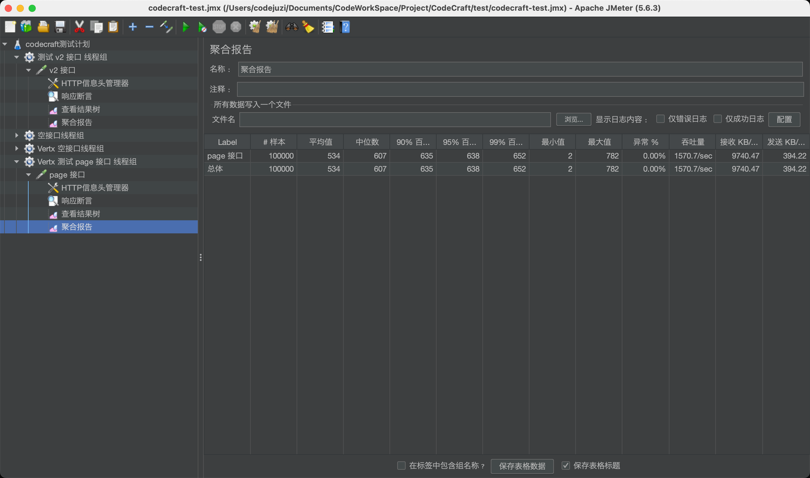

QPS 还降低了？为什么用了 Vert.x后反而更慢了？

答：很正常的现象，因为每个技术都有适合它的应用场景。

Vert.x 是一个基于事件驱动、非阻塞、异步的框架，它的设计目标是处理大量并发连接。与之相反，Spring Boot 内置的 Tomcat 是同步阻塞模型。在某些场景下（比如传统 CRUD 应用、或者 IO 操作较少），同步阻塞模型可能会更适用，因为都需要等待数据处理完成后再返回响应，反而减少了线程调度的成本。Vert.x 更适合于实时应用，例如聊天应用、实时通信等，或者 IO 密集型的任务。

